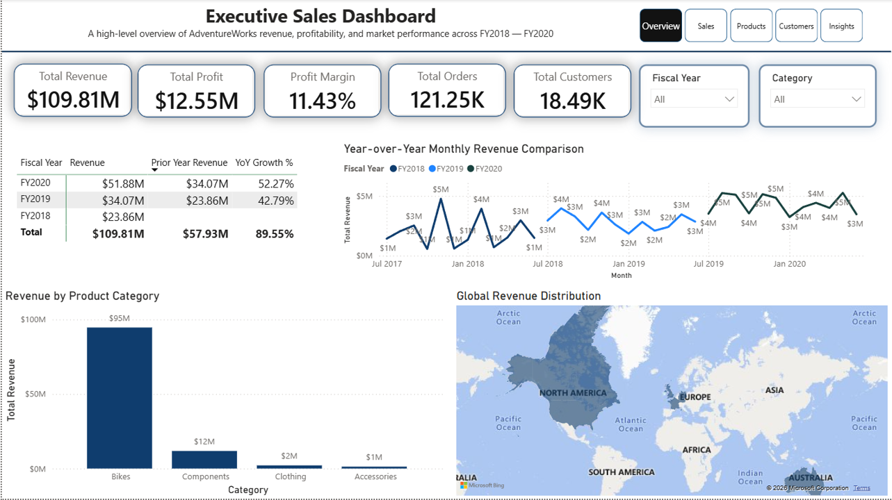
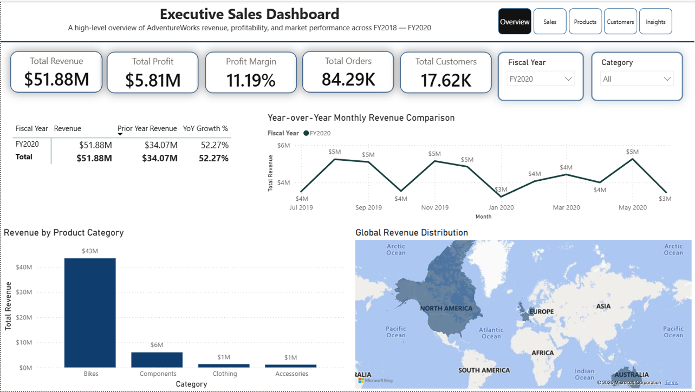
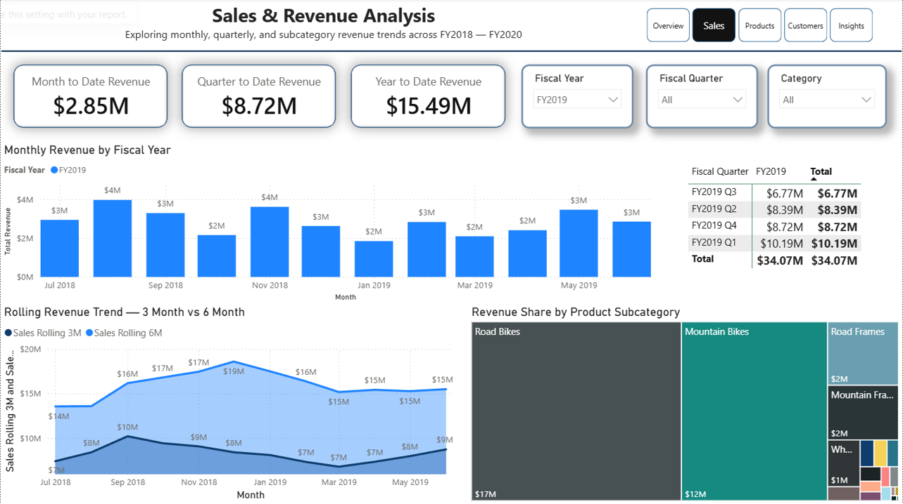
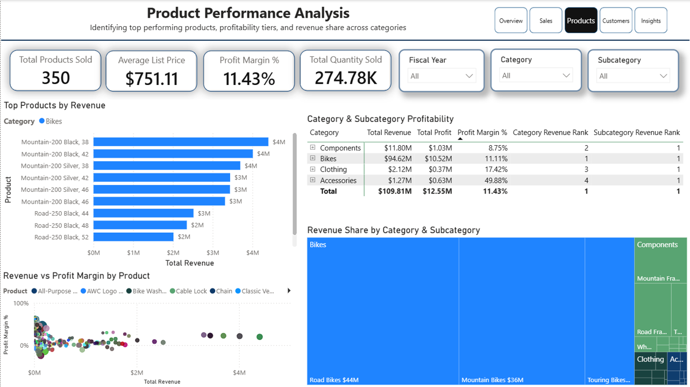
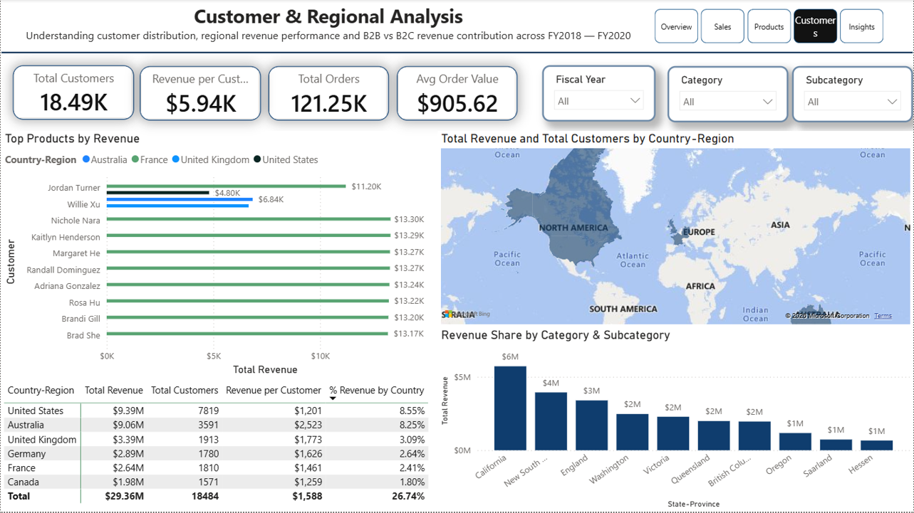
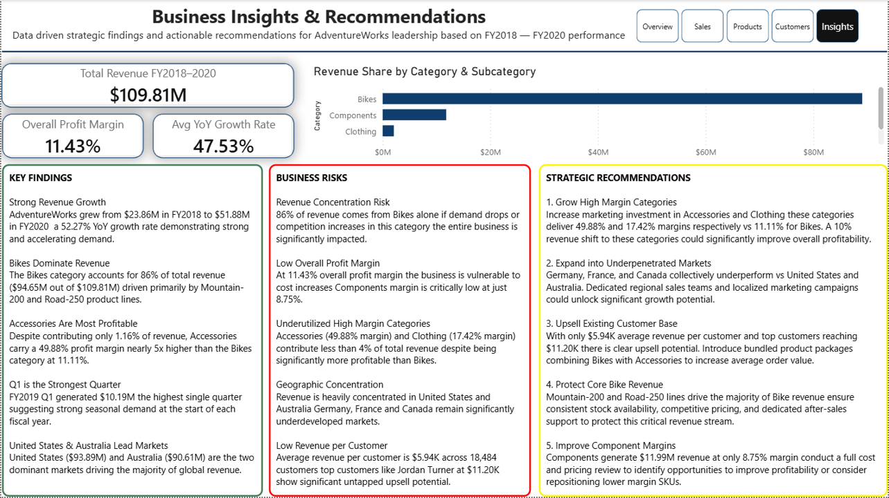

# AdventureWorks Sales Analytics Dashboard

A business problem driven interactive Power BI dashboard built on the Microsoft AdventureWorks dataset covering FY2018 — FY2020, designed to help leadership identify revenue trends, product performance, and regional opportunities.

---

## Dashboard Preview





---

## Business Problem

AdventureWorks is experiencing inconsistent revenue growth across regions, products, and customer segments. Leadership needs a centralized dashboard to identify where revenue is being lost, which products and customers drive the most profit, and where to focus sales efforts.

---

## Dashboard Pages

### Page 1 — Executive Summary
High level overview of total revenue, profit, orders, and customers with year over year comparison and geographic revenue distribution.





### Page 2 — Sales & Revenue Analysis
Monthly and quarterly revenue trends with rolling 3 month and 6 month averages and subcategory revenue breakdown.





### Page 3 — Product Performance
Top 10 products by revenue, category and subcategory profitability matrix, revenue vs profit margin scatter plot, and revenue share treemap.





### Page 4 — Customer & Regional Analysis
Top 10 customers by revenue, geographic revenue map, country level breakdown, and state level revenue analysis.





### Page 5 — Business Recommendations
Data driven strategic findings and actionable recommendations for leadership based on FY2018 — FY2020 performance.





---

## Key Insights

- Total revenue grew from **$23.86M in FY2018** to **$51.88M in FY2020** — a 52.27% YoY growth rate
- **Bikes drive 86%** of total revenue at 11.11% profit margin
- **Accessories deliver 49.88% margin** but contribute only 1.16% of revenue — significant growth opportunity
- **United States and Australia** are the two dominant markets driving majority of global revenue
- Average revenue per customer is **$5.94K** across 18,484 customers with top customers reaching $11.20K

---

## Data Model

Star schema with 7 tables — 2 fact tables and 5 dimension tables.

| Table | Type |
|---|---|
| Sales | Fact |
| SalesOrder | Fact |
| Customer | Dimension |
| Product | Dimension |
| Date | Dimension |
| Reseller | Dimension |
| SalesTerritory | Dimension |

For full data model documentation see [Data Model](Documentation/Data_Model.md)

---

## DAX Measures

47 measures built across 8 categories all stored in a single `_Measures` table.

| Category | Count |
|---|---|
| Base Sales | 10 |
| Customer | 7 |
| Product | 12 |
| Time Intelligence | 14 |
| KPI Targets | 6 |
| Dynamic Titles | 4 |
| Advanced | 2 |
| **Total** | **47** |

For full DAX documentation see [DAX Measures](Documentation/DAX_Measures.md)

---

## Key Features

- Star schema data model with 7 tables
- 47 DAX measures including time intelligence
- YoY, MoM, MTD, QTD, YTD calculations
- Rolling 3 month and 6 month revenue trends
- Interactive drill downs and cross filtering
- Geographic revenue mapping
- Top N filtering on products and customers
- Dynamic page titles using SELECTEDVALUE
- Business recommendations backed by real data

---

## Tools Used

| Tool | Purpose |
|---|---|
| Power BI Desktop | Dashboard development |
| DAX | Measure calculations |
| Power Query | Data loading and transformation |
| Microsoft AdventureWorks | Source dataset |

---

## How to Use

1. Download `AdventureWorks Sales Dashboard.pbix.`
2. Open in Power BI Desktop
3. Use slicers to filter by Fiscal Year, Category, and Region
4. Navigate pages using buttons on top right
5. Click any visual to cross filter other visuals on the page
6. Drill down on matrix visuals from Category to Subcategory level

---

## Dataset

**Source:** Microsoft Official Sample Data
**Download:** [AdventureWorks Sales Sample](https://github.com/microsoft/powerbi-desktop-samples/blob/main/AdventureWorks%20Sales%20Sample/AdventureWorks%20Sales.xlsx)

For full dataset documentation see [Data README](Data/README.md)

---

## Documentation

| File | Description |
|---|---|
| [DAX Measures](Documentation/DAX_Measures.md) | All 47 measures with formulas and descriptions |
| [Data Model](Documentation/Data_Model.md) | Schema diagram, relationships, and design decisions |
| [Data README](Data/README.md) | Dataset source and table descriptions |

---

## Repository Structure

```
Sales-Analytics-Dashboard-PowerBI/
│
├── README.md
├── AdventureWorks_Dashboard.pbix
│
├── Screenshots/
│   ├── 01_Executive_Summary_Overview.png
│   ├── 02_Executive_Summary_FY2020.png
│   ├── 03_Sales_Analysis_FY2019.png
│   ├── 04_Sales_Analysis_FY2020_Q4.png
│   ├── 05_Product_Performance_Overview.png
│   ├── 06_Customer_Regional_Overview.png
│   └── 07_Business_Recommendations.png
│
├── Data/
│   ├── README.md
│   └── AdventureWorks_Sales.xlsx
│
└── Documentation/
    ├── DAX_Measures.md
    └── Data_Model.md
```

---

## Author

**Ajay Gande**

[GitHub](https://github.com/ajaygande) | [LinkedIn](https://www.linkedin.com/in/ajay-gande) | [Email](mailto:ajaygande1@gmail.com)

---

*AdventureWorks Sales Analytics — a business driven Power BI dashboard 
showcasing data modeling, DAX measures, and actionable business insights.*
